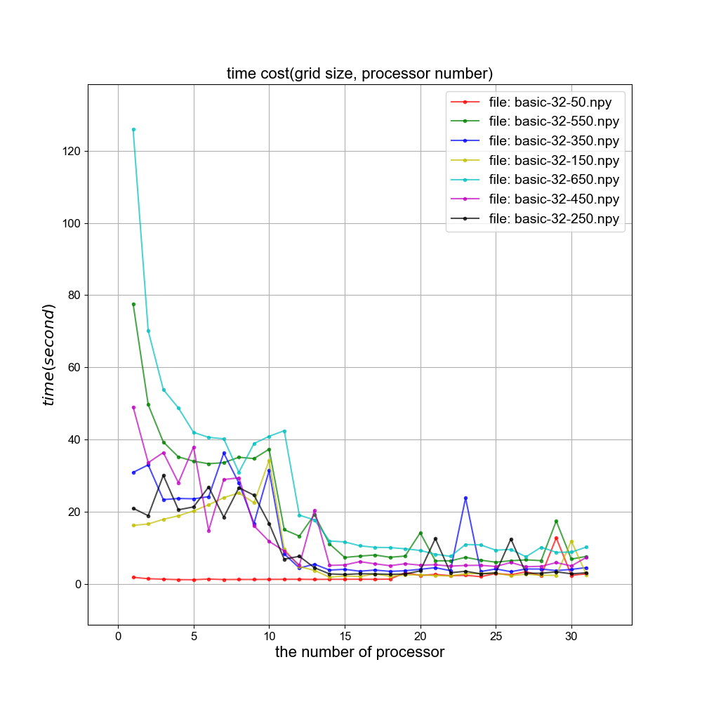

# Solving the Wave Equation Using MPI

[](https://opensource.org/licenses/MIT) 

The governing equation - The aim of this assignment is to write a parallel solver for the wave equation:

$$ \frac{\partial^{2}u}{{\partial t}^{2}} = c^{2}\nabla^{2}u $$

The discretised equation is explicit and can be rearranged as follows:

$$ \frac{u_{i,j}^{n + 1} - 2u_{i,j}^{n} + u_{i,j}^{n - 1}}{{\mathrm{\Delta}t}^{2}} = c^{2}\left( \frac{u_{i + 1,j}^{n} - 2u_{i,j}^{n} + u_{i - 1,j}^{n}}{{\mathrm{\Delta}x}^{2}} \right) $$


## 🍕 Requirements

- C++ version >= 11

- STL required

- Python > 3.8

- matplot and numpy required

- cmake and make

- MPI required

### 🚀 Quick Start

For running the application, first make the build folder and cd into the dictionary. Then using cmake and make to compile, and then run it.

```bash
#Linux or macos
mkdir build && cd build
cmake .. && make
mpiexec -n 4 ./MPI-CourseWork

```

## 🚩 **Usage**

The structure of project is show blow:

- src: source files storaged
- scripts: including python tool scripts
- Tests: unit tests folder
- hpc-work: hpc scripts and run configuration
- data / img: time record files and images

This gif picture show the propagation of wave when applying two disturbances. 


## 🚍 Performance

As following pic shows, 


